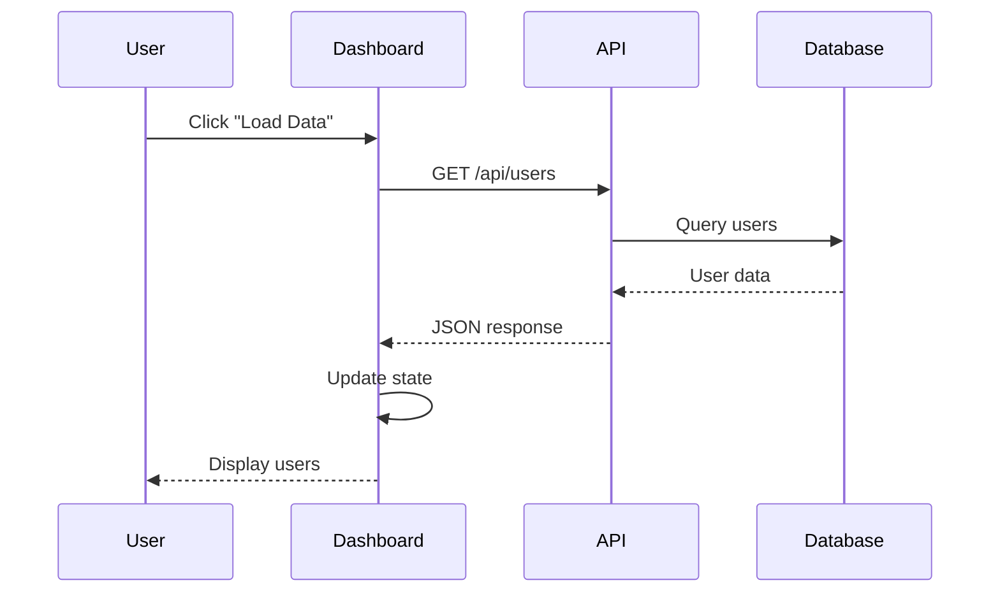
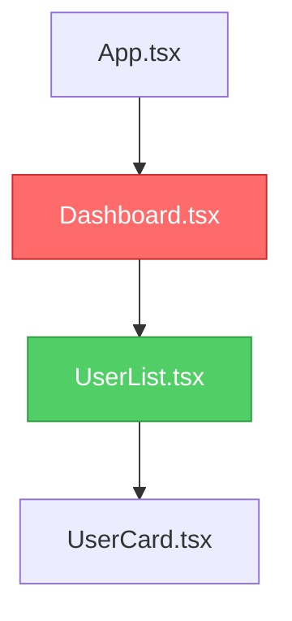
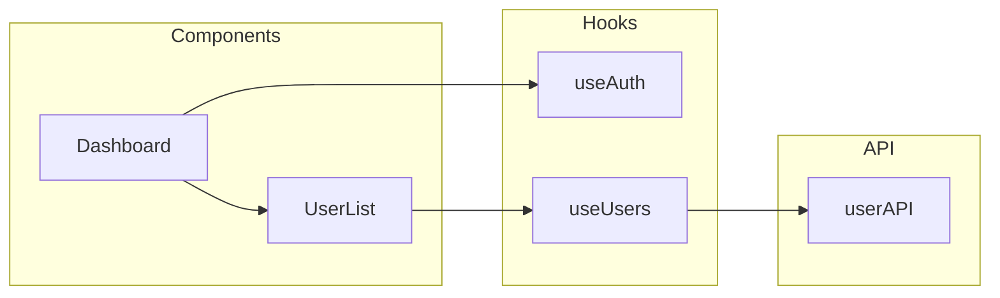
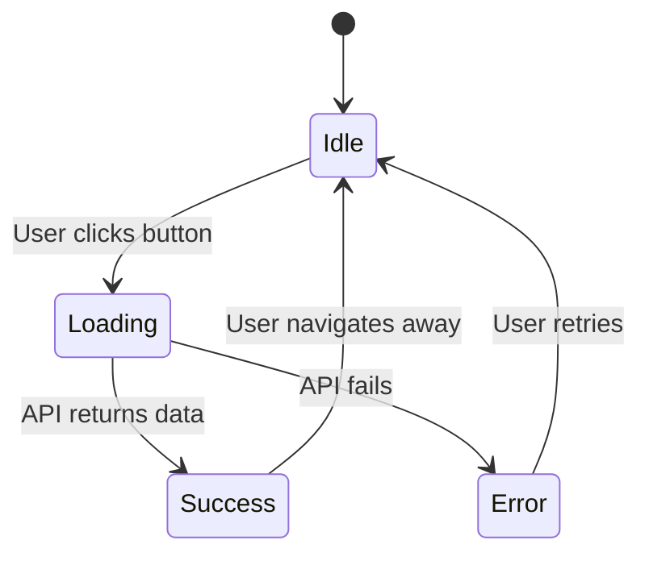

# PR Diagrams

CodeBear generates up to four Mermaid diagrams per PR review, giving reviewers and authors an instant visual understanding of the changed code.

---

## Diagram Types

### Sequence Diagram — Data Flow & Interactions

Shows how data moves through the application: user interactions, component rendering, API calls, state updates, and side effects.

Generated when: files contain `fetch`, `axios`, or `useEffect`.

Example:


---

### Component Hierarchy — Architecture

Visualizes React component parent-child relationships. Files with issues are highlighted in red; clean files in green.

Generated when: always (all PR reviews).

Example:


---

### Dependency Graph — Module Dependencies

Shows import/export relationships between files and external packages. Grouped by type (components, hooks, utils, api). Circular dependencies are marked with dotted lines.

Generated when: 2 or more files are analyzed.

Example:


---

### State Flow — State Management

Visualizes state transitions and side effects from `useState`, `useReducer`, `useContext`, Redux, or Zustand.

Generated when: files contain state management primitives.

Example:


---

## PR Comment Format

Diagrams appear in collapsible sections in the review comment:

```markdown
## CodeBear Review

### Overall Score: C

...summary and issues...

---

### Visual Analysis

<details open>
<summary>Data Flow & Interactions</summary>
Shows how data flows through components, API calls, and state updates

[mermaid diagram]
</details>

<details>
<summary>Component Architecture</summary>
Visual hierarchy of React components and their relationships

[mermaid diagram]
</details>

<details>
<summary>Module Dependencies</summary>
Shows import/export relationships and module dependencies

[mermaid diagram]
</details>
```

---

## Performance

| Diagram Type | Generation Time | Approx LLM Cost |
|---|---|---|
| Sequence | ~2–3 s | ~$0.0003 |
| Component Hierarchy | ~2–3 s | ~$0.0003 |
| Dependency Graph | ~2–3 s | ~$0.0003 |
| State Flow | ~2–3 s | ~$0.0003 |
| Total (all four) | ~8–12 s | ~$0.0012 |

---

## Complexity Limits

Diagrams are automatically simplified for large PRs:
- Sequence diagrams: max 15 interactions
- Component hierarchy: grouped by folder for large component trees
- Dependency graph: only direct dependencies shown

---

## Troubleshooting

**Diagrams not rendering in GitHub** — Check that the Mermaid output is under GitHub's 50KB limit. Large PRs may produce truncated diagrams.

**Diagram doesn't match code** — LLM generation is probabilistic. For highly complex PRs, treat diagrams as a starting point and verify manually. File an issue if a specific pattern is consistently wrong.

**Slow diagram generation** — Diagrams are generated in parallel. If latency is a concern, use `gemini-2.0-flash-8b` (faster, lower cost) and enable caching for unchanged files.

---

## Adding a New Diagram Type

1. Add the new type to the `DiagramType` union in `lib/llm/diagram-generator.ts`
2. Implement the generation function
3. Add detection logic in `generateDiagrams()`
4. Add the label in `lib/github/comment-formatter.ts`
5. Update this document

---

Back to [README](../README.md)